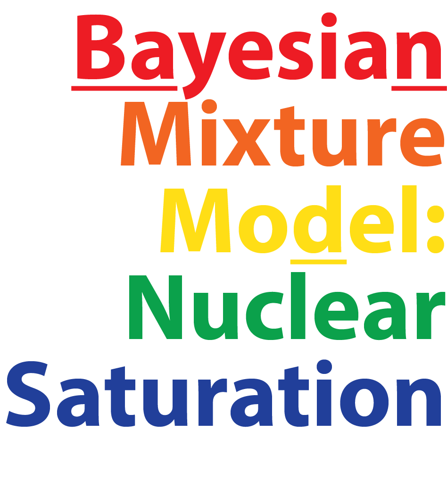

# A Bayesian mixture model approach to quantifying the _empirical_ nuclear saturation point


The nuclear equation of state (EOS) in the limit of isospin symmetric matter at zero temperature exhibits a minimum at the so-called nuclear saturation point. We use a Bayesian approach with conjugate distributions to extract the empirical nuclear saturation point from a range of Density Functional Theory (DFT) constraints, including those from relativistic mean field (RMF) theory and Skyrme energy density functionals.

This repository supplements our [manuscript][manuscript].

We aim to provide statistically meaningful constraints on the nuclear saturation point to benchmark (and guide the construction of novel) microscopic interaction derived from chiral effective field theory (EFT). 


## Overview

The repository is organized as follows:
* `data`: contains all DFT and EFT data files, with author and other relevant information
* `modules`: contains classes, functions, and more relevant to our analysis. It also provides a function to calculate and plot confidence regions of the bivariate t-distribution analytically. See the Appendices in our manuscript for more details.
* `samples`: contains samples of the symmetry energy and its slope parameter obtained using BUQEYE's EFT truncation error repository as well as all other files containing samples
* `pdf`: contains the figures generated in the PDF format
* `logo`: contains the files for this project's logo

The following Jupyter notebooks are included:
* `analysis_conjugate_priors.ipynb`: performs the conjugate prior analysis presented in the manuscript. The notebook supports parallel computing. Downloading the samples from Giuliani et al. requires an internet connection and might take a while to finish. This has to be done only once.
* `tutorial_conf_regions.ipynb`: provides a tutorial on plotting confidence regions of the t-distribution using the tools developed.
* `sample_SV_L.ipynb`: derives constraints on the nuclear symmetry energy parameters $(S_v,L)$ from chiral EFT calculations in pure neutron matter combined with empirical constraints on the nuclear saturation point. It requires and interfaces with the public BUQEYE GitHub repository containing their [nuclear matter analysis](https://github.com/buqeye/nuclear-matter-convergence).
* `tests.py` defines several unit tests (see below)

In addition, `saturation_analysis_mc.ipynb` provides an independent implementation of our saturation analysis using brute-force Monte Carlo sampling. It could be used to check and generalize our analysis using conjugate priors. Another virtual environment with packages specified in `requirements_mc.txt` needs to be installed following the instructions above. This notebook was _not_ used in our manuscript. It is provided without support.


## Installation and testing

Follow these steps to run the code locally in a virtual environment using a Jupyter Notebook:

```shell
python3 -m venv env_satpoint
source env_satpoint/bin/activate
python3 -m pip install -r requirements_conj.txt
python3 -m ipykernel install --name "satpoint"
jupyter-notebook&  # pick the kernel "satpoint"
# deactivate # when the job is done
```

You may need to specify the HDF5 directory, e.g., using the environment variable 
```shell
export HDF5_DIR=/opt/homebrew/Cellar/hdf5/1.14.1  # the location may be different on your computer
```

Run the following `pytest` command to test important components of the code (may take a while):

```shell
python3 -m pytest tests.py
```

### Optional: Brute-force Monte Carlo approach

Optionally, to run `saturation_analysis_mc.ipynb`, you will need a different virtual environment due to inter-package incompatibilities:

```shell
python3 -m venv env_satpoint_mc
source env_satpoint_mc/bin/activate
python3 -m pip install -r requirements_mc.txt
python3 -m ipykernel install --name "satpoint_mc"
jupyter-notebook&  # pick the kernel "satpoint_mc"
# deactivate # when the job is done
```

This notebook was _not_ used in our manuscript. It is provided without support for instructional purposes.

## Cite this work

Please use the following BibTeX entry to cite our work:

```bibtex
@article{Drischler:2024ebw,
    author = "Drischler, C. and Giuliani, P. G. and Bezoui, S. and Piekarewicz, J. and Viens, F.",
    title = "{A Bayesian mixture model approach to quantifying the empirical nuclear saturation point}",
    eprint = "2405.02748",
    archivePrefix = "arXiv",
    primaryClass = "nucl-th",
    month = "5",
    year = "2024"
}
```


## Contact details

Christian Drischler (<drischler@ohio.edu>)  
Department of Physics and Astronomy   
Ohio University  
Athens, OH 45701, USA  

Frederi Viens (<fv15@rice.edu>)   
Department of Statistics   
Rice University   
Houston, TX 77005, USA   

[manuscript]: https://inspirehep.net/literature/2783496
